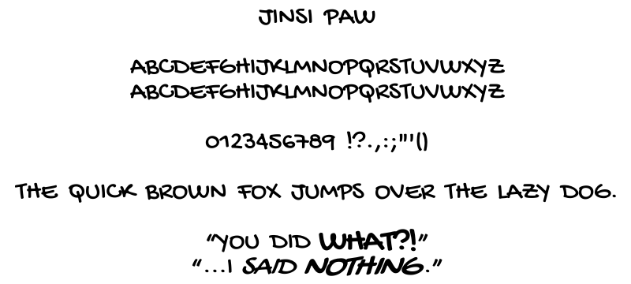

# Jinsi Paw

**Jinsi Paw** is a hand-lettered font designed primarily for comic and manga lettering. I highly recommend using only the uppercase letters however I also packaged this font with lowercase just in case you want to give that a try. 

**Jinsi Paw** is a modified version of **Gochi Hand**, originally created by Huerta Tipografica, with changes intended to make the typeface better suited to comic dialogue and lettering inspired by the likes of Anime Ace.

## Changes from Gochi Hand

Jinsi Paw includes the modifications:
* Revised character spacing
* Revised word spacing
* Adjusted vertical metrics and line spacing
* Bold style
* Oblique style
* Bold Oblique style
* Revised font metadata and family organization

The goal of these modifications is to make the font better suited for comic and manga lettering. Character spacing has been tightened so words cluster more naturally, while the spacing between words has been increased to improve readability. The line height has also been reduced to minimize dead space and allow dialogue to fit more comfortably inside speech bubbles. I aimed to recreate the kind of spacing and visual rhythm found in Anime Ace!

Bold and Italic styles have also been added with emphasis in mind. Bold text is approximately 25% larger than the Regular style, while Italic text is approximately 13% larger. Bold Italic uses the same size as Bold. These differences are intentional since I wanted these emphasized words remain easy to read at a distance and stand out more clearly within a speech bubble.

## Fonts
The following styles are currently included:
* Jinsi Paw Regular
* Jinsi Paw Bold
* Jinsi Paw Oblique
* Jinsi Paw Bold Oblique

Prebuilt `.ttf` files can be found in the `fonts/` directory.

## Installation

Download the desired `.ttf` files from the latest release and install them using your operating system's normal font installation method.

## License

Jinsi Paw is licensed under the **SIL Open Font License, Version 1.1**.

It is derived from Gochi Hand.

Copyright (c) 2011, Huerta Tipografica ([www.huertatipografica.com.ar](http://www.huertatipografica.com.ar)), with Reserved Font Names "Gochi" and "Gochi Hand".

Copyright (c) 2026, Essa, for modifications distributed under the name "Jinsi Paw".

See `OFL.txt` for the complete license.
